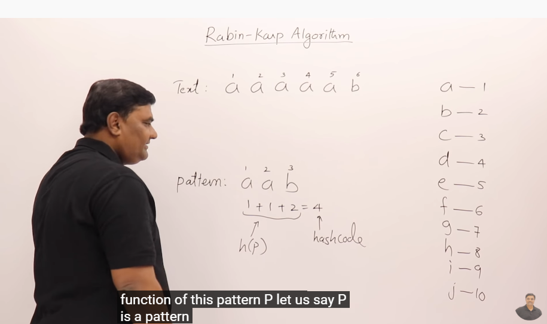
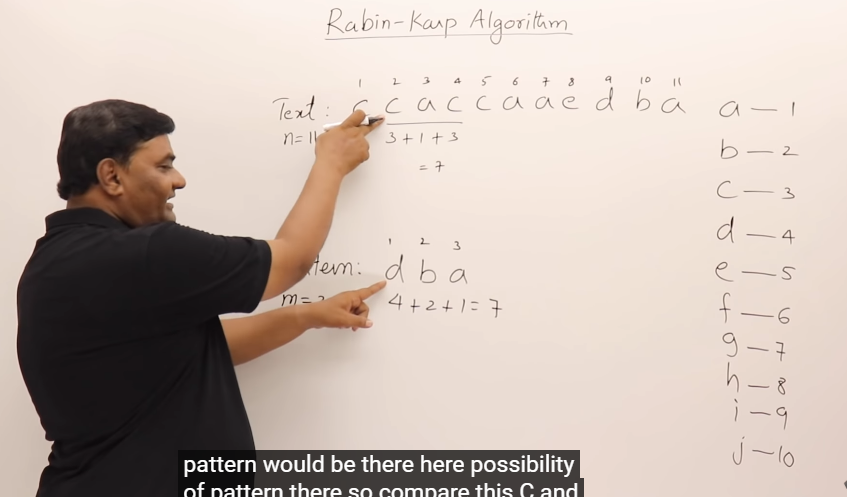
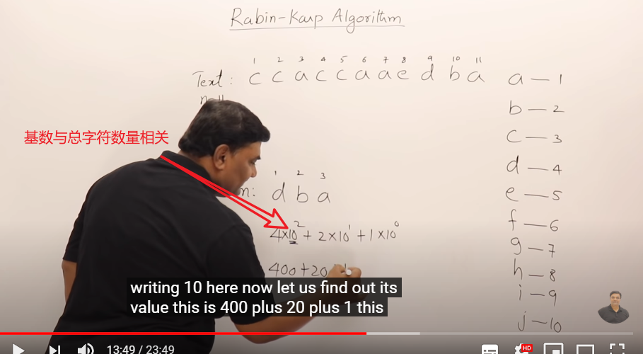
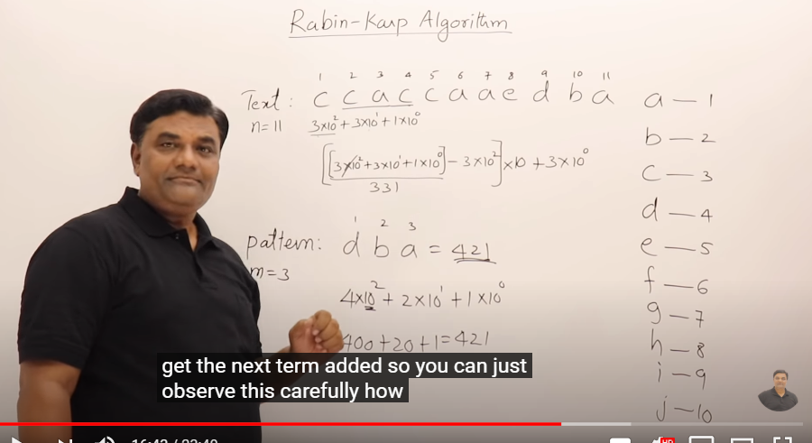
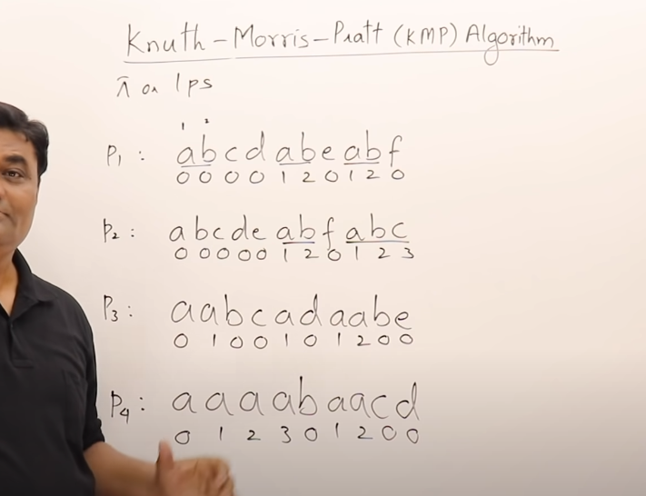
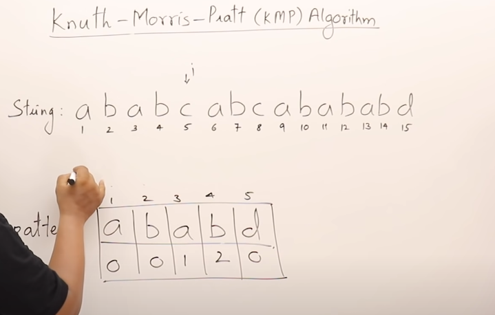
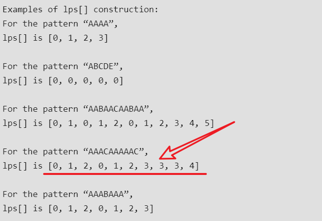

## minimun cost spanning tree
spanning tree: 用cost最小的边连接所有节点。
对于图G=(V,E)，其对应的spanning tree中，edge数量为节点数量减一。
### 多少种不同的spanning tree可以被生成？
$$C_{|E|}^{|V|-1}-number\ of\ cycles$$

### 在weighted graph中，找到最小cost的spanning tree
方法一、遍历所有的spanning tree  
方法二、Prim's algorithm  
1. 在图中取出最短权值的边
2. 继续从图中取出最短权值的边，但是取出的边需要与之前已取出的边相连
3. 重复步骤2.

该方法的缺点是无法识别分离的子图

方法三、Kruskal's algorithm   
思路：始终寻找最小cost的边。但是如果最新挑选的边，与之前挑选的边形成了cycle，则不把这条边挑选出来。  
如果使用min heap来输出最小cost的边，则方法三的时间复杂度为$nlog(n)$  

kruskal算法可以找到分离子图中的最小生成树

## Dijkstra算法
> 可以解决在非负的边权重情况下，一个节点到图中所有其他相通节点的最短距离

全局变量：考察队列queue
1. 将起始节点cost设置为0，其他所以节点的cost设置为Inf
2. 将起始节点加入queue中
3. 取出队列queue的所有节点中，cost值最小的节点$q$，考察该节点的所有后继节点$q^{'}$的权值：if $cost(q)+cost(q,q^')<cost(q^')$，则$cost(q^')=cost(q)+cost(q,q^')$.（这个过程称为relaxation）
   -     Add $q^{'}$ to queue.

## heap
保持complete属性很重要：
### 插入元素
插入元素时以叶节点插入，然后进行大小调整，这样可以保持complete  leaf->root
时间复杂度为$log(n)$

### 删除元素
删除元素时把最后一个叶节点补到root位置，然后从root->leaf往下调整
时间复杂度为$log(n)$

### heap sort
1. create a heap $O(nlogn)$
2. delete max/min element from heap and store it in the place. $O(nlog(n))$
3. heap sort time complexity $O(nlogn)$

### heapify
used to create a heap, but time complexity is $O(n)$
与前面创建heap的方法不同，heapify从叶节点倒序开始，检查以自身为根节点的子树是否是一个heap.
因为最后一层叶节点本来就是heap，所以从倒数第二层开始比较，每个节点最多交换一次；倒数第三层每个节点最多交换二次；...  

### priority queue
如果是一般的array，要根据优先级输出元素，则要么插入元素需要花费$O(n)$,要么删除要花费$O(n)$
而若队列表示成一个heap，则插入或删除都只需要$O(log(n))$  

### heapq
```py
import heapq # 注意heap不在collections中， deque属于collections
heapq.heappush(heap,item)
heapq.heappop(heap)
heapq.heappushpop(heap,item)
heapq.heapify(x) # 原地，线性时间内
heapq.heapreplace(heap,item) # pop之后加入item，更高效
```

## merge sort
1. based on two way merge, merge2(list1,list2), time complexity $O(m+n)$
2. divide and conquer, merge sort $T(n)=2T(n/2)+n$
3. merge sort time complexity $O(nlog(n))$

## quick sort
原理：老师排队，每个人检查自己与前一个人的身高关系
sorted position: 如果每个人前面的人都比自己低，而后面的人都比自己高，则自己所在的位置就是自身的
sorted position.


## XOR
运算法则：  
$a \oplus a=0$  
$a \oplus b=b \oplus a$  
$a \oplus b \oplus c=a \oplus(b \oplus c)=(a \oplus b) \oplus c$  
$a \oplus b \oplus a=b$

python中表示为`^`
```py
a=b^c
```

## symmetric difference
对称差：两个集合的对称差包含只属于其中一个集合的元素，而不属于另一个集合

## permutation and combination
排列：从给定的元素中取出指定个数的元素进行排列
$$A_{n}^{m}=n(n-1)(n-2) \bullet \bullet(n-m+1)=\frac{n !}{(n-m) !}$$
组合：仅考虑从给定的元素中取出指定个数的元素
$$C_{n}^{m}=\frac{A_{n}^{m}}{m !}=\frac{n !}{m !(n-m) !}$$

注意：$0!=1$

## hashing technique
search techniques:
1. linear search-O(n)
2. binary search-O(log(n))   for sorted elements
3. hashing-O(1)
   
   通过设计hashing function，让key到hash tabel的映射更加节省空间。

   如何解决collision?

### Collision resolution methods:
1. open hashing-chaining. 将hashing table中的index冲突的key作为一个chain存储在hash tabel中的对应位置
2. closed hashing
   open addressing $h(x)=(h(x)+f(i))\ mod\  size$
   1. linear probing。如果地址冲突，线性寻找下一个空闲的空间。$f(i)=i$
   2. quadratic probing. $f(i)=i^2$

## prefix sum algorithm
A nomal algorithm takes $O(m\times n)$ time to perform m number of queries to find range sum on n size array.

Prefix sum algorithm takes $O(n)$ time to perform m number of queries to find range sum on n size array.

$$A[i,j]=A[j]-A[i-1]$$
Prefix sum algorithm takes O(n) to calculate the prefix sum array, and take O(1) to respond to an query.

## DFS and BFS

### DFS
1. preorder: node -> left -> right
2. inorder: left -> node -> right
3. postorder: left -> right -> node

```py
# preorder
[root.val]+preorder(root.left)+preorder(root.right) if root else []

# inorder
inorder(root.left)+[root.val]+inorder(root.right) if root else []

# postorder
postorder(root.left)+postorder(root.right)+[root.val] if root else []
```

### BFS
iterations with the queue

### string matching
Rabin-kap Algorithm




rolling hash function



如果hash function过于简单，则可能出现与其他pattern冲突的情况-> spurious hits

如果pattern的长度为$m$, 序列总长度为$n$，则最差的时间复杂度为$O(mn)$， 意味着每一个位置都会有冲突；最好的时间复杂度为$O(n-m+1)$，意味着hash function没有冲突。

因此需要一个strong hash function







 使用mod来防止过高的hash值

## find duplicated number
重点在于如何根据重复数据来构造一个包含环的路径，而且重复元素要位于这个环的起点位置

用数字来作为下一个迭代的下标，可以有效应对重复元素不只出现两次的情况。

## 迭代函数的返回值
迭代函数的返回值设置为想要维持的全局计数结果，可以避免使用list这种引用数据类型。

## KMP pattern search algorithm
Knuth Morris Pratt Pattern Searching.

- naive pattern search algorithm: time complexity $O(m(n-m+1))$.
- KMP time complexity $O(n)$

KMP uses degenerating property (pattern having same sub-patterns appearing more than once in the pattern) of the pattern and improves the worst case complexity.

Preprocessing pattern and prepare an integer array lps[]. （longest prefix suffix)





算法原理在于：

若在匹配过程中发现不匹配的情况，那么就通过lps中存储的值，将pattern的考察下标修改为上一个重复前缀出现的位置。如果不匹配发生在某一次前缀重复出现之后，那么pattern的考察下标将会移动到上一个前缀重复的位置；如果不匹配发生在普通的过程中，那么pattern的考察下标将会直接移动到pattern的首部。




## deque
```py
from collections import deque
queue=deque(iterable_type)
queue.append(value)
queue.popleft()
```
> 从空deque中pop元素会引发IndexError


